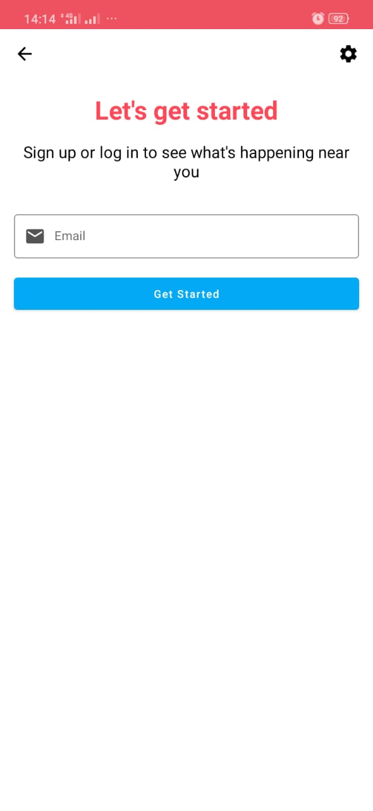
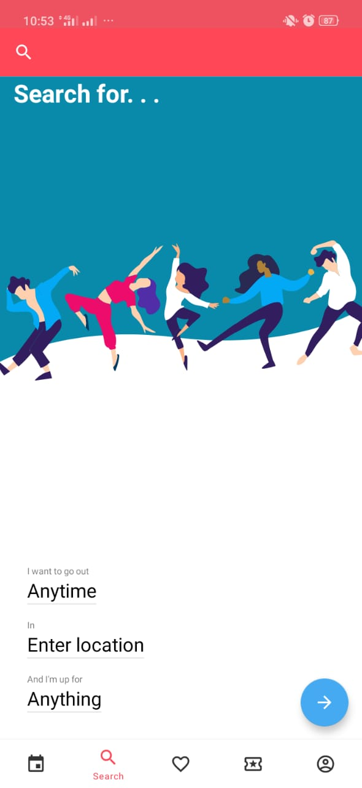
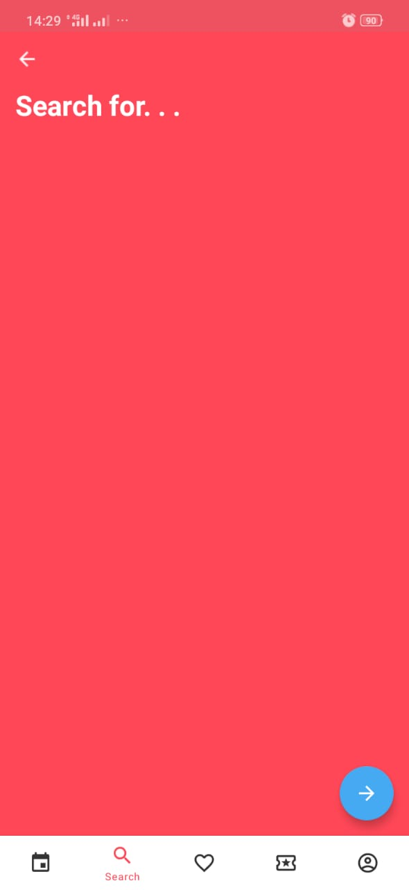
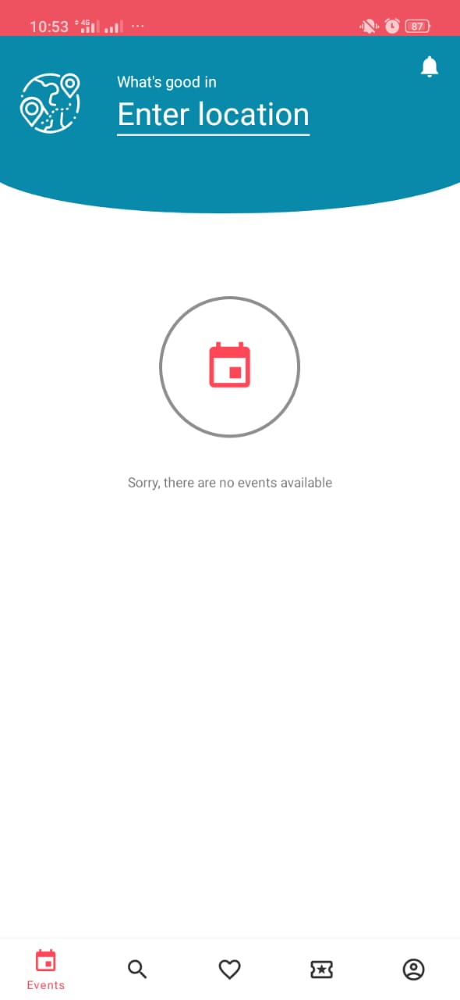
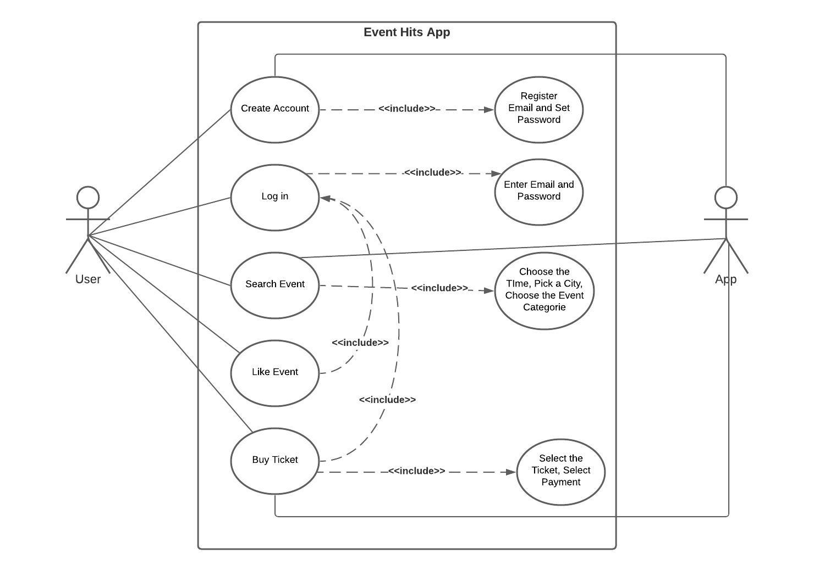
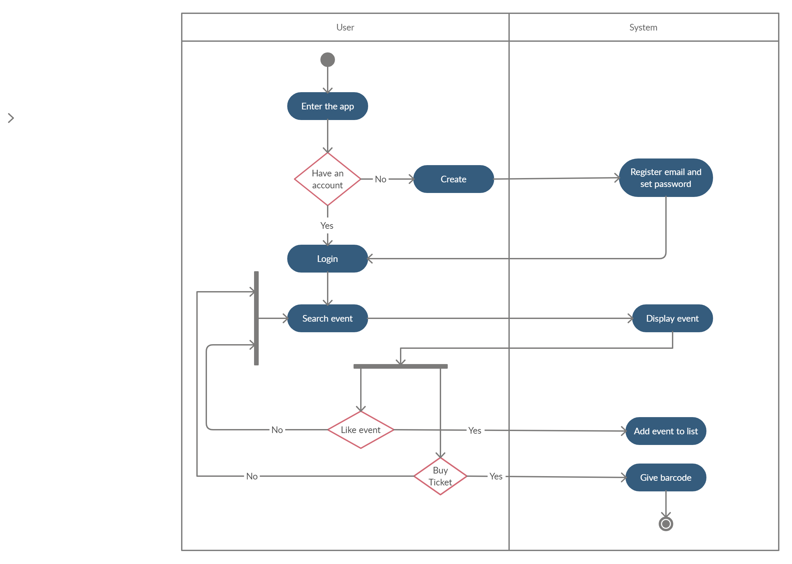

<h1>Task 1 : Evaluation of Existing App</h1>  
<h2>The Reasons Why the Original Design is Unpleasant and Cumbersome to Use</h2>

<h3>The First</h3>
  
  
 On this page, the user is asked to enter an email. But it is not clear whether this is an email to register or to log into an existing account. And that will make user feel confused. Then, when the user enters an email that has never been used to register, he will be taken to a page to create an account. However, if the user enter an email that has already been used to register, he will be taken to the login page. 

<h3>The Second</h3>

 
On the search page there are three places that have the same function. And those are the search symbols at the top, the words "search for ...", and the blue button at the bottom. And in our opinion, that is not necessary because it will only confuse the user about what differences between the three search results will display. 

 
Then, when the search symbol is clicked, the display will change to something like a notes view. And that's pretty weird. Because, looking for an event, it doesn't need that big space.

<h3>The Third</h3>

 
Then, on this Events page. The user must enter a city to simply display events. Though, it is a front view which would be better if on this page all the events were displayed. After all, if the user had to enter the city first, then how would it be different from the search page.

<h2>Use Case</h2> 

<h2>Activity Diagram</h2> 

<h2>Narration</h2> 

Start with enter the application. User will be asked to login to his account, if he doesn’t have an account yet, then he can create one first. After that, user can search an event on the search section, and the system will display the events that relate. So, user can choose to like the event or directly buy the ticket. If the user chooses to like the event, the system will automatically add the event to the list of liked events. But, if the user chooses to buy a ticket and do the payment, then the system will automatically give the barcode of the event.
  

<h2>Identify The Key Use Case</h2> 

Buy ticket is the key use case of Event Hits App. 
Because the propose of this app is to provide any events and get the online ticket in the same application. And it is what makes this app interesting. while, the other use cases are included and must be fulfilled in order to finally be able to buy ticket.

