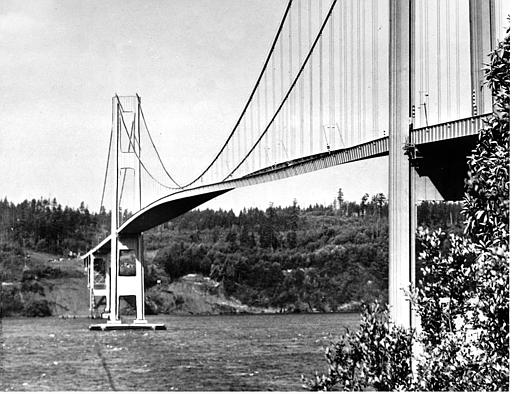

<h1>Jembatan Tacoma Narrows Runtuh</h1> 

 sumber gambar: https://images.app.goo.gl/nViazZZX8KXCTGkcA

Jembatan ini didesain mampu menahan angin sampai 100 kilometer (km) per jam. Namun ketika baru beroperasi sekitar enam bulan, jembatan kabel ini runtuh dan disebabkan oleh angin 64 km per jam, yang artinya jauh dari kekuatan yang telah diperhitungkan. Jembatan Tacoma putus di struktur dekat tiang bagian tengah. Kabel penghubung antara tiang dan kabel utama putus sebagian. Berdasarkan sebuah investigasi, putusnya kabel utama ini disebabkan oleh rotasi di dekat tumpuan penyangga struktur pada tiang. Dan rotasi itu membuat jembatan bergoyang oleh angin dan resonansi dari tegangan kabel. Hingga akhirnya struktur bangunan tak mampu menahan bebannya sendiri. Tacoma Narrow pun runtuh.  
Kegagalan desain 
Kegagalan desain Jembatan Tacoma Narrows adalah karena strukturnya tidak kuat meredam getaran. Maka, perlu adanya penambahan berat pada struktur jembatan itu sehingga bisa tahan terhadap tekanan angin. Oleh karena itu, kami menambah lebar jalan dari 12 meter menjadi 30 meter, menambahkan beban pada bagian bawah jembatan dan juga bagian bawahnya dibuat berongga supaya angin bisa melewati jembatan tanpa hambatan. Dengan begitu jembatan tidak mudah bergoyang ketika terkena terpaan angin kencang.
