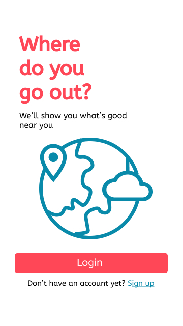
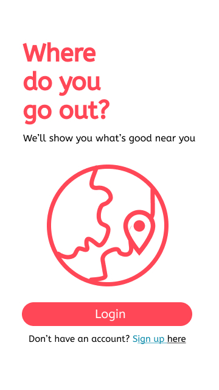

<h1> Task 2: Applying Design Sprint</h1>

<h2>Day 1 Report</h2>

On the Day 1, we discussed about why the application has problems. And we've found three things that we're going to evaluate. And those three things are about the login and sign up form, the search page, and the main page that display the events. 
<a href = "https://youtu.be/XCVpdf0LS6A">The video can be streamed here.</a> 

This discussion was held on Tuesday, October 6th 2020.
  
<h2>Day 2 Report</h2>

On the Day 2, two of our team members work to compete to make designs with the material design principle 
  DESIGN 1 
  This one is an accepted design.
  
  
  
  
  DESIGN 2
  
  
  
  

This was held on Wednesday to Friday, October 7th-9th 2020.

<h2>Day 3 Report</h2>

On the Day 3, we've had a virtual meeting. There are two of our team members who explain about the designs that have been made by each of them. And we also voted by involved two people from the other team. 
<a href = "https://youtu.be/Ez75Tp5MBt4">The video can be streamed here.</a> 

 This meeting was held on Saturday, October 10th 2020.
 
<h2>Day 4 Report</h2>

On the Day 4, we've had a virtual meeting with the developer. we explained about why our design's necessary. And the developer gave us a little feedback. 
The video can be streamed here :  

This meeting was held on Tuesday, October 13th 2020.
