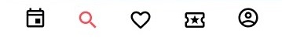
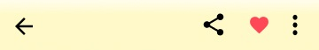
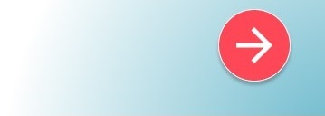
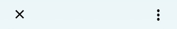
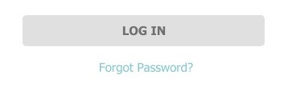

<h1> Task 2: Applying Design Sprint</h1>

<h2>Day 1 Report</h2>

On the Day 1, we discussed about why the application has problems. And we've found three things that we're going to evaluate. And those three things are about the login and sign up form, the search page, and the main page that display the events. 
-<a href = "https://youtu.be/XCVpdf0LS6A">The video can be streamed here.</a> 
-<a href="https://github.com/dewsgnt/HCI/blob/hw2/TASK%202/Subtitle_For_The_First_Video.pdf">And the subtitle is also available here.</a>

This discussion was held on Tuesday, October 6th 2020.
  
<h2>Day 2 Report</h2>

On the Day 2, two of our team members work to compete to make designs with the material design principle  
  DESIGN 1.<a href="https://github.com/dewsgnt/HCI/blob/hw2/TASK%202/desain.png"> Click here for the design details.</a> 
  
  
  
  
  DESIGN 2.<a href="https://github.com/dewsgnt/HCI/blob/hw2/TASK%202/desain2.png"> Click here for the design details.</a>
  
  
  
  

This was held on Wednesday to Friday, October 7th-9th 2020.

<h2>Day 3 Report</h2>

On the Day 3, we've had a virtual meeting. There are two of our team members who explain about the designs that have been made by each of them. And we also voted by involved two people from the other team. 
-<a href = "https://youtu.be/Ez75Tp5MBt4">The video can be streamed here.</a> 
-<a href="https://github.com/dewsgnt/HCI/blob/hw2/TASK%202/Subtitle_For_The_Second_Video.pdf">And the subtitle is also available here.</a>

 This meeting was held on Saturday, October 10th 2020.  
  <a href="https://github.com/dewsgnt/HCI/blob/hw2/TASK%202/desain.png"> Click here for the design details.</a> 
  This one is an accepted design.
  
  
  
  
 
<h2>Day 4 Report</h2>

On the Day 4, we've had a virtual meeting with the developer. we explained about why our design's necessary. And the developer gave us a little feedback. 
-<a href="https://youtu.be/KZ-LBU_-GN4">The video can be streamed here.</a> 
-<a href="https://github.com/dewsgnt/HCI/blob/hw2/TASK%202/Subtitle_For_The_Third_Video.pdf">And the subtitle is also available here.</a> 

This meeting was held on Tuesday, October 13th 2020.
  
  
 <h3>Explanation of Material Design Utilization in Chosen Design.</h3>
 
 
 
 
1.These icons symbolize common actions. Each icon is expressing an essential characteristic. We also use high-emphasis "on" color for the active icon in a bottom bar.  
  
 
  
  
2. On the top bar, we put the most used action on the far left, and the second most used action to its right. We also give an adequate space around system icons to allow legibility and touch.  
  
  
  
  
3. We use a floating button that contrast with the content to make its surface edges and shape noticeable.  
  
  
  
  
4. We use the overflow menu icon with three vertical dots to indicate the “more” symbol.  
  
  
  
  
  
5. We use capitalized button text labels to distinguish the text label from surrounding text.  
  
  
  
  
  
6. Text labels can also be written in sentence case, and we use another characteristic to distinguish it such as color contrast.  
